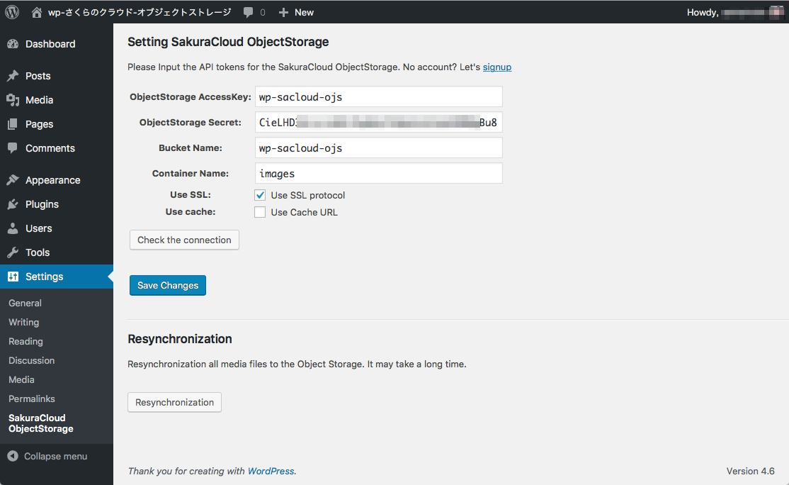

# WordPress plugin for SakuraCloud ObjectStorage.

WordPressのメディアファイル(画像など)をさくらのクラウドのオブジェクトストレージで扱うためのWordPressプラグインです。

WordPressの管理画面からメディアを追加すると、自動的にオブジェクトストレージにアップロードを行います。
オブジェクトストレージは容量無制限なため、空き容量を気にすること無くメディアファイルを扱うことができます。

また、このプラグインはメディアファイルのURLを変更し、オブジェクトストレージから直接配信するように設定します。
これにより、WordPressを運用しているサーバに負荷をかけずに、メディアファイルを配信することができます。

さくらのクラウド オブジェクトストレージの機能である、SSL配信、キャッシュ配信にも対応しています。

## スクリーンショット

## インストール/設定

WordPressの管理ページからインストール可能です。
詳細は[インストール/設定](docs/README.md)を参照してください。

## 既存WordPressサイトへの導入

[既存WordPressサイトへの導入手順の例](docs/Migration.md)

# License

GPLv2

# Copyright

Copyright 2016 Kazumichi Yamamoto
