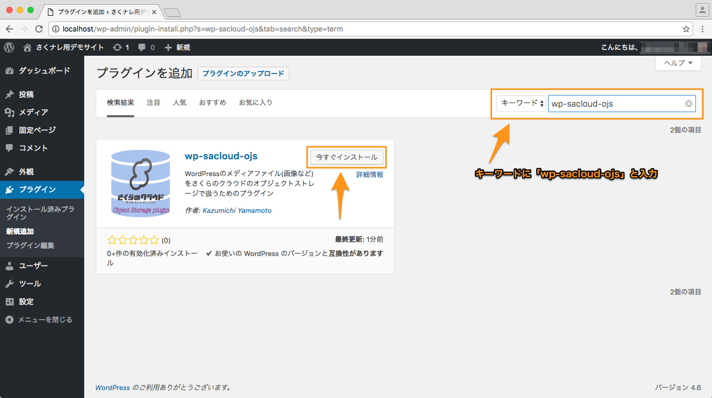
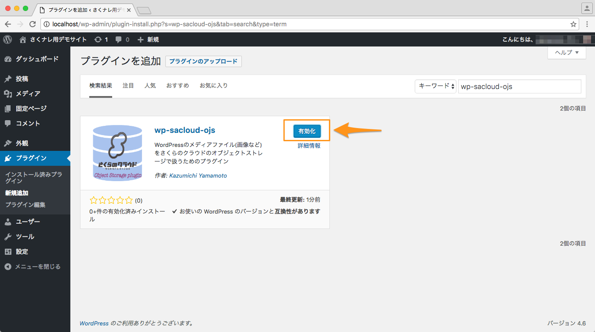
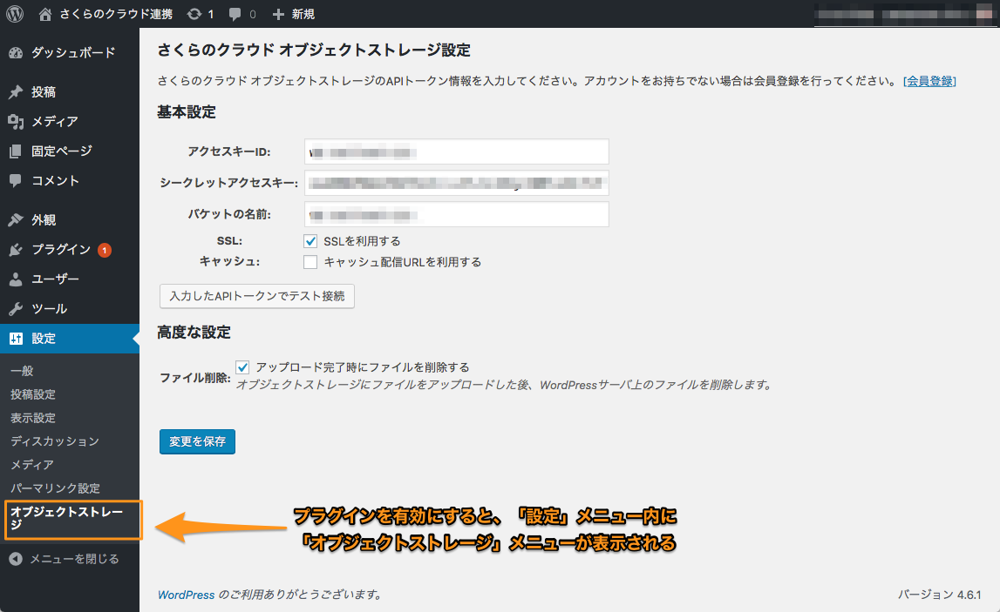
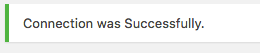
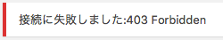

## インストール/設定

## 目次

  - [事前準備](#事前準備)
  - [インストール](#インストール)
  - [設定](#設定)
  - [WP-CLIサポートについて](#wp-cliサポートについて)

## 事前準備

  - [さくらのクラウドのコントロールパネル](https://secure.sakura.ad.jp/cloud/)からオブジェクトストレージのバケットを作成してください。

  - 作成したバケットのアクセス制御(パブリック)を`パブリック(GET)`に設定してください。

  - 作成したバケットの以下項目を控えておいてください。

    - バケットの名前
    - アクセスキーID
    - シークレットアクセスキー

---

## インストール

WordPress管理画面からプラグインのインストールを行います。

WordPressへログイン後、左メニューから「プラグイン」、「新規追加」を選択します。

---

「プラグインを追加」画面が表示されます。
右上のキーワード欄に「wp-sacloud-ojs」と入力してください。
プラグインが検索されたら「今すぐインストール」ボタンを押下します。

---

しばらく待つとインストールが完了するはずです。完了したら「有効化」ボタンを押下します。

以上でインストール完了です。

## 設定

プラグインの動作に必要な、アクセスキーなどの設定を行います。

左のメニューから「設定」、「さくらのクラウド オブジェクトストレージ」を選択します。

「さくらのクラウド　オブジェクトストレージ設定」画面が表示されます。必要情報を入力していきます。各項目は以下のように入力します。

#### 基本設定
  - アクセスキーID：先ほど控えた値を入力する
  - シークレットアクセスキー：先ほど控えた値を入力する
  - バケットの名前：先ほど控えた値を入力する
  - SSL：ファイルの配信時にSSLを利用する場合はチェックを入れます。
  - キャッシュ：キャッシュ配信機能を利用する場合はチェックを入れます。

#### 高度な設定
  - ファイル削除：オブジェクトストレージにファイルをアップロードした後、WordPressサーバ上のファイルを削除します。

---

#### 接続確認

各項目を入力したら「入力したAPIトークンでテスト接続」ボタンで接続確認が行えます。
入力値が正しい場合、以下のようなメッセージが表示されます。

エラーがある場合は以下のようなメッセージとなります。
この場合、各入力項目を再度確認してみてください。

テスト接続が成功したら「変更を保存」ボタンを押下します。

以上で設定終了です。

## WP-CLIサポートについて

wp-sacloud-ojsでは[WP-CLI](http://wp-cli.org)をサポートしています。

sap-sacloud-ojsを有効にすると、wp-cliに対し`sacloud-ojs`というコマンドが追加されます。

現在、以下のサブコマンドをサポートしています。

### `upload-all`サブコマンド

投稿データ(wp_posts)から添付ファイルデータを全件取得し、オブジェクトストレージにアップロードします。
[`ファイル削除`](#高度な設定)設定が有効な場合、アップロード後にローカルのファイルは削除されます。

#### 利用例

    wp sacloud-ojs upload-all
  

